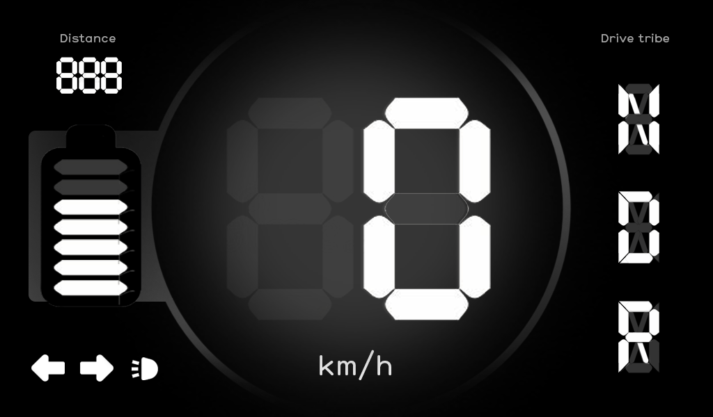
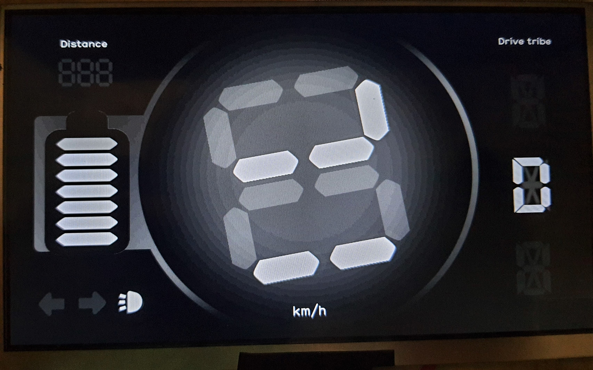
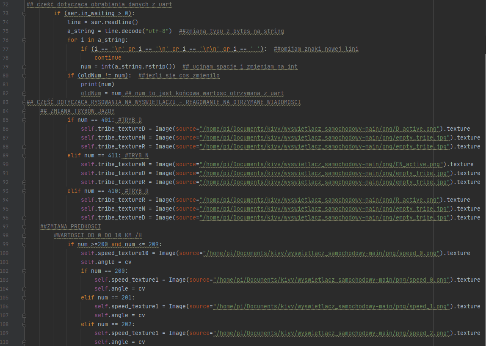
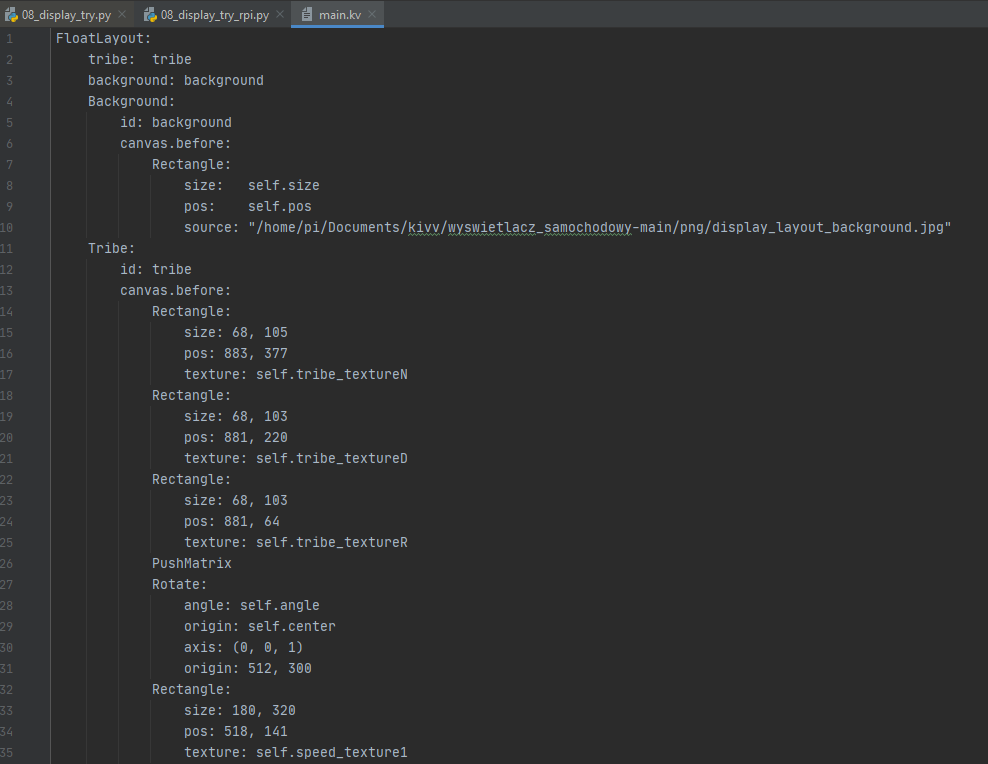

# CAR DESPLAY
> The aim of this project was to create main display to prototype an electric car.

## Table of contents
* [General info](#general-info)
* [Screenshots](#screenshots)
* [Technologies](#technologies)
* [Setup](#setup)
* [Features](#features)
* [Status](#status)
* [Contact](#contact)

## General info
My task in this project was to create a software to display that will show information such as the car's current speed, 
drive tribe, activity of lights and indicators, battery capacity or car range.
Because the display was supposed to be on the steering wheel, the main challenge was the functionality of rotating the displayed speed value 
together with the steering wheel rotation, so that the displayed speed was always vertical.

## Screenshots

Video: https://youtu.be/UKCcZLCUUvA

## Technologies
* Kivy - version 2.0.0
* Python - version 3.9
* Raspberry Pi OS Kernel - version 5.4
* PyCharm - version 2020.2.5
* RPi 3B+

## Setup
https://kivy.org/doc/stable/gettingstarted/installation.html

## Code Examples

## Features
List of features ready and TODOs for future development
* Rotating the displayed speed value.
* Program starts right after system startup.
* No refreh delay.

To-do list:
* Independence from display size.
* Displaying any errors.

## Status
Project is finished for this version of prototype, probably in next version it will be done on STM32, acording to long time to start Raspberry Pi OS and huge power consumptions.

## Contact
Created by https://www.linkedin.com/in/kamil-gradowski-8706991aa , gradowski.kam@gmail.com- feel free to contact me!
grados73
